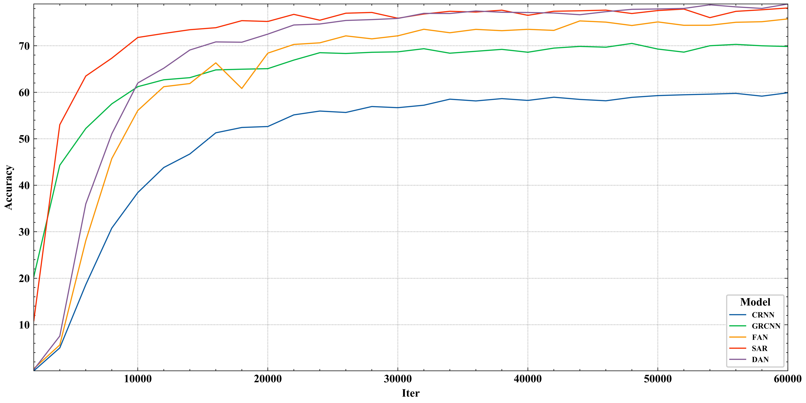
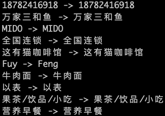
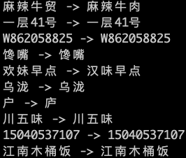
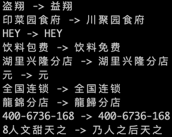
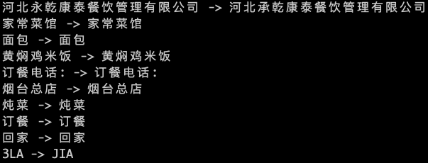
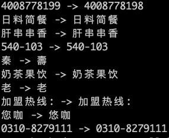

# text recognition toolbox

## 1. 项目介绍

该项目是基于pytorch深度学习框架，以统一的改写方式实现了以下5篇经典的文字识别论文，论文的详情如下。该项目会持续进行更新，欢迎大家提出问题以及对代码进行贡献。

| 模型  | 论文标题                                                     | 发表年份 | 模型方法划分                                    |
| ----- | ------------------------------------------------------------ | -------- | ----------------------------------------------- |
| CRNN  | 《An End-to-End Trainable Neural Network for Image-based Sequence Recognition and Its Application to Scene Text Recognition》 | 2017     | CNN+BiLSTM+CTC                                  |
| GRCNN | 《Gated recurrent convolution neural network for OCR》       | 2017     | Gated Recurrent Convulution Layer + BiSTM + CTC |
| FAN   | 《Focusing attention: Towards accurate text recognition in natural images》 | 2017     | focusing network+1D attention                   |
| SAR   | 《Show, attend and read: A simple and strong baseline for irregular text recognition》 | 2019     | ResNet+2D attention                             |
| DAN   | 《Decoupled attention network for text recognition》         | 2020     | FCN+convolutional alignment module              |

## 2. 如何使用

### 2.1 环境要求

```python
torch==1.3.0
numpy==1.17.3
lmdb==0.98
opencv-python==3.4.5.20
```

### 2.2 训练

* 数据准备

首先需要准备训练数据，目前只支持lmdb格式的数据，数据转换的步骤如下：

1. 准备图片数据集，图片是根据检测框进行切分后的数据
2. 准备label.txt，标注文件需保持如下的格式

```
1.jpg 文字检测
2.jpg 文字识别
```

3. 进行lmdb格式数据集的转换

```
python3 tools/create_lmdb_dataset.py --inputPath {图片数据集路径} --gtFile {标注文件路径} --outputPath {lmdb格式数据集保存路径}
```

* 配置文件

目前每个模型都单独配备了一个配置文件，这里以CRNN为例， 配置文件主要参数的含义如下：

| 一级参数     | 二级参数               | 参数含义                                    | 备注                                                         |
| ------------ | ---------------------- | ------------------------------------------- | ------------------------------------------------------------ |
| TrainReader  | dataloader             | 自定义的DataLoader类                        |                                                              |
|              | select_data            | 选择使用的lmdb格式数据集                    | 默认为'/'，即使用{lmdb_sets_dir}路径下所有的lmdb数据集。如果想控制同一个batch里不同数据集的比例，可以配合{batch_ratio}使用，并将数据集名称用'-'进行分割，例如设置成'数据集1-数据集2-数据集3' |
|              | batch_ratio            | 控制在一个batch中，各个lmdb格式数据集的比例 | 配合{select_data}进行使用，将比例用'-'进行分割，例如设置成'0.3-0.3-0.4'。即数据集1使用batch_size * 0.3的比例，剩余的数据集以此类推。 |
|              | total_data_usage_ratio | 控制使用的整体数据集比例                    | 默认为1.0，即使用全部的数据集                                |
|              | padding                | 是否对数据进行padding补齐                   | 默认为True，设置为False即采用resize的方式                    |
| Global       | highest_acc_save_type  | 是否只保存识别率最高的模型                  | 默认为False                                                  |
|              | resumed_optimizer      | 是否加载之前保存的optimizer                 | 默认为False                                                  |
|              | batch_max_length       | 最大的字符串长度                            | 超过这个字符串长度的训练数据会被过滤掉                       |
|              | eval_batch_step        | 保存模型的间隔步数                          |                                                              |
| Architecture | function               | 使用的模型                                  | 此处为'CRNN'                                                 |
| SeqRNN       | input_size             | LSTM输入的尺寸                              | 即backbone输出的通道个数                                     |
|              | hidden_size            | LSTM隐藏层的尺寸                            |                                                              |

* 模型训练

完成上述配置后，使用以下命令即可开始模型的训练：

```python
python train.py -c configs/CRNN.yml
```

### 2.3 预测

* 配置文件

同样地，针对模型预测，也都单独配备了一个配置文件，这里以CRNN为例， 需要修改的配置参数如下：

| 一级参数 | 二级参数         | 参数含义                                 | 备注                           |
| -------- | ---------------- | ---------------------------------------- | ------------------------------ |
| Global   | pretrain_weights | 模型文件路径                             | 剩余配置参数和训练保持一致即可 |
|          | infer_img        | 待预测的图片，可以是文件夹或者是图片路径 |                                |

* 模型预测

完成上述配置后，使用以下命令即可开始模型的预测：

```python
python predict.py -c configs/CRNN.yml
```

## 3. 预训练模型

以下是5个开源的中文自然场景数据集，可以直接根据上述的模型配置进行模型训练：

| 数据集                                                       | 网盘地址                                                     | 备注                           |
| ------------------------------------------------------------ | ------------------------------------------------------------ | ------------------------------ |
| 一共包括5个自然场景训练集：<br />ArT_train, LSVT_train, MTWI_train, RCTW17_train, ReCTS_train<br />以及一个自然场景验证集：ReCTS_val | 链接: https://pan.baidu.com/s/1fvExHzeojA_Yhj3_wDflwA <br />提取码: kzrd | "train"是训练集，"val"是验证集 |

以下为5个算法的预训练模型，训练的明细请见第4部分里的实验设定：

| 模型                                                         | 网盘地址                                                     | 备注 |
| ------------------------------------------------------------ | ------------------------------------------------------------ | ---- |
| 一共包含5个预训练模型：CRNN.pth, GRCNN.pth, FAN.pth, DAN.pth, SAR.pth<br />以及一个字典文件：keys.txt | 链接: https://pan.baidu.com/s/1IG-1lxytrOqry9c5Nc1GzQ <br />提取码: k3ij  |      |

## 4. 实验结果

针对目前已复现的5个算法，我用统一的数据集以及参数设定进行了实验对比，实验设定以及实验结果如下：

* 实验设定

| 实验设定   | 明细                                                         | 备注                                                         |
| ---------- | ------------------------------------------------------------ | ------------------------------------------------------------ |
| 训练集     | ArT_train：44663<br />LSVT_train：218552<br />MTWI_train：79964<br />RCTW17_train：33342<br />ReCTS_train：83119 | 这5个均为开源自然场景数据集，其中做了剔除模糊数据等处理      |
| 验证集     | ReCTS_val：9231                                              | 测试集为从ReCTS中按照9:1比例划分的验证集，注意ReCTS以水平文本居多 |
| batch_size | 128                                                          |                                                              |
| img_shape  | [1, 32, 256]                                                 | 尺寸进行等比例放缩，小于256的进行padding，大于256的resize至256 |
| optimizer  | function: adam<br />base_lr: 0.001<br />momentum: 0.9<br />weight_decay: 1.0e-4 |                                                              |
| iter       | 60000                                                        | 一共训练了60000步，每2000步会进行一次验证                    |

* 实验结果

| 算法  | 最高识别率 | 最大正则编辑距离 | 模型大小 |
| ----- | ---------- | ---------------- | -------- |
| CRNN  | 59.89      | 0.7959           | 120M     |
| GRCNN | 70.51      | 0.8597           | 78M      |
| FAN   | 75.78      | 0.8924           | 764M     |
| SAR   | 78.13      | 0.9037           | 722M     |
| DAN   | 78.99      | 0.9064           | 639M     |

下图为各个算法在验证集上的识别率，每2000步会进行验证：



* 预测结果示例

| 算法  | 预测结果                                                     | 备注                                                         |
| ----- | ------------------------------------------------------------ | ------------------------------------------------------------ |
| CRNN  |  | 预测结果均取自验证集识别率最高的模型，<br />左边一列为预测结果，右边为标注结果 |
| GRCNN |  |                                                              |
| FAN   |  |                                                              |
| SAR   |  |                                                              |
| DAN   |  |                                                              |

